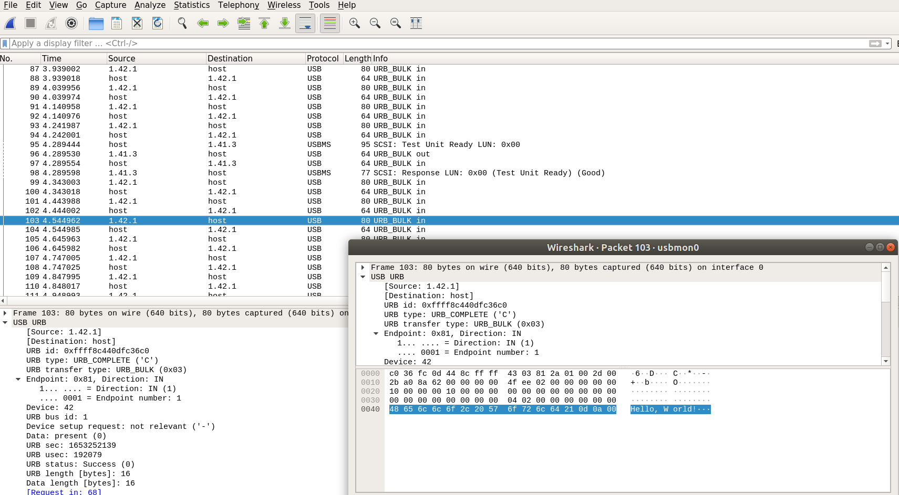

# 10 Big Concepts in USB learning
  1. Transfer
	2. Transaction
	3. Packet
	4. Host
	5. Device
	6. Configuration
	7. Interface
	8. Endpoint
	9. Pipe
	10. Descriptors. 


# Four types of transfers
  - Control
	- Bulk
	- Interrupt
	- Isochronous

	Bulk and Isochronous transaction requires one or more transactions. 


# USB - total addresses
	- Each hosts can talk to 127 devices. 

# Configuration
	- The configuration for devices.
	- There can be multiple but only one for each device will be selected by the host.

# Endpoint
	- Each endpoint has one function.
	- Each interface can have multiple endpoints. 
	- Endpoint is the buffer for data receival on device side.

# Pipe
	- Software concept, the connnection between the only host and other devices. 

# Descriptors:
	- Different types of descriptors for different type of devices. 
	  Device descriptor
		Configuration descriptor
		Interface descriptor 
		Endpoint descriptor
		String descriptor

	- Descriptors for HID devices
	  HID descriptors
		Report descriptors
		Physical descriptors


# Device descriptor
| Offset | Name                | Size  | Description                         |
|--------|---------------------|-------|-------------------------------------|
| 0      | bLength             |   1   | descriptor length                   | 
| 1      | bDescriptorType     |   1   | descriptor type                     |
| 2      | bcdUSB              |   2   | USB version                         |
| 4      | bDeviceClass        |   1   | class                               |
| 5      | bDeviceSubClass     |   1   | subclass                            |
| 6      | bDeviceProtocol     |   1   | protocal that the device uses       |
| 7      | bMaxPacketSize0     |   1   | largest packet size endpoint 0 uses |
| 8      | idVendor            |   2   | vendor ID                           |
| 10     | idProduct           |   2   | product ID                          |
| 12     | bcdDevice           |   2   | device version                      |
| 14     | iManufacturer       |   1   | manufacturer index                  |
| 15     | iProduct            |   1   | product index                       |
| 16     | iSerialNumber       |   1   | serial number index                 |
| 17     | bNumConfigurations  |   1   | possible number of configurations.  |


# CDC uses bulk for the payload data and interrupt for line notifications. 



# Signal Levels [ Table 7-2. Low-/full-speed Signaling Levels ]
| Bus State                           | Representation                                    | 
|------------------------------------ | ------------------------------------------------- |
| Data J state                        | LS: Differential "0"    FS: Differential "1"      |
| Data K state                        | LS: Differential "1"    FS: Differential "0"      |
| Start of Packet (SOP)               | Data lines IDLE -> K state                        |
| End of Packet (EOP)                 | SE0 for 2 bit times followed by J for 1 bit time. |

# What is J state?
  The polarity when bus is idle.

	LS: DP --> L DM --> H
	FS/HS: DP --> H DM --> L

# What is K state?
	The reverse of J state. 


# The USB Host-Device Model
```
Host ---.
        |
        |                       .---- EP0 IN
        |         Device 1      |---- EP0 OUT
        |________ Addr = 29 ----|
        |                       |---- EP1 IN
        |                       |---- EP1 OUT
        |
        |
        |
        |                       .---- EP0 IN   
        |         Device 2      |---- EP0 OUT
        |________ Addr = 41 ----|
                                |---- EP1 IN
                                |---- EP1 OUT
```

# Endpoints
Endpoints can be = sources or sinks of data. 
USB bus is host centric. The device cannot write to the bus anytime it wants.
All devices must support endpoint zero --> for device control and status requests.


# Composition of USB Packet 

  SYNC - PID 
  - Each USB packet starts with a SYNC field.
      SS/FS --> KJKJKJ KK 
      HS    --> KJKJKJKJKJKJKJKJKJKJKJKJKJKJKJ KK

  - Right after SYNC is the packet identifier field -- PID. [ Table 8-1. PID Types ] 
      PID = four bit encoded data + four bit 1's complement. 
      Four types of PID:
      1. Token
         a. OUT
         b. IN
         c. SOF
         d. SETUP

         Token Packet looks like this:
         SYNC - PID - ADDR - ENDP - CRC5 - EOP

      2. Data
         a. DATA0 
         b. DATA1
         c. DATA2
         d. MDATA

         Data Packet looks like this:
         SYNC - PID - DATA - CRC16 - EOP

      3. Handshake
         a. ACK
         b. NAK
         c. STALL
         d. NYET

         Handshake Packet looks like this:
         SYNC - PID - EOP

      4. Special 
         a. PRE
         b. ERR
         c. SPLIT
         d. PING
         e. Reserved.

         Special Packet looks like this:
         SYNC - PID - FRAME_NUMBER - CRC5 - EOP

  - Function endpoints are addressed through: function address field + endpoint field. 

    LSb                                 MSb
    Addr0 Addr1 Addr2 Addr3 Addr4 Addr5 Addr6 --> 7 bits = 128 addresses.

    Endpoint0 Endpoint1 Endpoint2 Endpoint3 --> 4 bits = 16 endpoints.

    


  
  


# Following output was obtained through lsusb:

  $ lsusb

  >
  Bus 001 Device 039: ID 0483:5740 STMicroelectronics STM32F407
  Couldn't open device, some information will be missing
  Device Descriptor:
    bLength                18
    bDescriptorType         1
    bcdUSB               2.00
    bDeviceClass            2 Communications
    bDeviceSubClass         2 Abstract (modem)
    bDeviceProtocol         0 None
    bMaxPacketSize0        64
    idVendor           0x0483 STMicroelectronics
    idProduct          0x5740 STM32F407
    bcdDevice            2.00
    iManufacturer           1 
    iProduct                2 
    iSerial                 3 
    bNumConfigurations      1
    Configuration Descriptor:
      bLength                 9
      bDescriptorType         2
      wTotalLength           67
      bNumInterfaces          2
      bConfigurationValue     1
      iConfiguration          0 
      bmAttributes         0xc0
        Self Powered
      MaxPower              100mA

      Interface Descriptor:
        bLength                 9
        bDescriptorType         4
        bInterfaceNumber        0
        bAlternateSetting       0
        bNumEndpoints           1
        bInterfaceClass         2 Communications
        bInterfaceSubClass      2 Abstract (modem)
        bInterfaceProtocol      1 AT-commands (v.25ter)
        iInterface              0 
        CDC Header:
          bcdCDC               1.10
        CDC Call Management:
          bmCapabilities       0x00
          bDataInterface          1
        CDC ACM:
          bmCapabilities       0x02
            line coding and serial state
        CDC Union:
          bMasterInterface        0
          bSlaveInterface         1 
        Endpoint Descriptor:
          bLength                 7
          bDescriptorType         5
          bEndpointAddress     0x82  EP 2 IN
          bmAttributes            3
            Transfer Type            Interrupt
            Synch Type               None
            Usage Type               Data
          wMaxPacketSize     0x0008  1x 8 bytes
          bInterval              16

      Interface Descriptor:
        bLength                 9
        bDescriptorType         4
        bInterfaceNumber        1
        bAlternateSetting       0
        bNumEndpoints           2
        bInterfaceClass        10 CDC Data
        bInterfaceSubClass      0 Unused
        bInterfaceProtocol      0 
        iInterface              0 
        Endpoint Descriptor:
          bLength                 7
          bDescriptorType         5
          bEndpointAddress     0x01  EP 1 OUT
          bmAttributes            2
            Transfer Type            Bulk
            Synch Type               None
            Usage Type               Data
          wMaxPacketSize     0x0040  1x 64 bytes
          bInterval               0
        Endpoint Descriptor:
          bLength                 7
          bDescriptorType         5
          bEndpointAddress     0x81  EP 1 IN
          bmAttributes            2
            Transfer Type            Bulk
            Synch Type               None
            Usage Type               Data
          wMaxPacketSize     0x0040  1x 64 bytes
          bInterval               0

# Originally usbd_cdc_if.c (HAL middle ware) was merged into usb-cdc-device.c

usb_device.c/.h carries only 
    the MX_USB_DEVICE_Init(void) 
    USBD_HandleTypeDef hUsbDeviceFS;
  that's the one earliest merged into usb_cdc_device.c/.h


The study can begin by merging:
  usbd_cdc_if.c
  usb_device.c
  usb_cdc.c

# USB Classes
| Base | Class      | Descriptor Usage Description                       |
|------|------------|----------------------------------------------------|
| 00h  | Device     | Use class information in the Interface Descriptors |
| 01h  | Interface  | Audio                                              |
| 02h  | Both       | Communications and CDC Control                     |
| 03h  | Interface  | HID (Human Interface Device)                       |
| 05h  | Interface  | Physical                                           |
| 06h  | Interface  | Image                                              |
| 07h  | Interface  | Printer                                            |
| 08h  | Interface  | Mass Storage                                       |
| 09h  | Device     | Hub                                                |
| 0Ah  | Interface  | CDC-Data                                           |
| 0Bh  | Interface  | Smart Card                                         |
| 0Dh  | Interface  | Content Security                                   |
| 0Eh  | Interface  | Video                                              |
| 0Fh  | Interface  | Personal Healthcare                                |
| 10h  | Interface  | Audio/Video Devices                                |
| 11h  | Device     | Billboard Device Class                             |
| 12h  | Interface  | USB Type-C Bridge Class                            |
| 3Ch  | Interface  | I3C Device Class                                   |
| DCh  | Both       | Diagnostic Device                                  |
| E0h  | Interface  | Wireless Controller                                |
| EFh  | Both       | Miscellaneous                                      |
| FEh  | Interface  | Application Specific                               |
| FFh  | Both       | Vendor Specific                                    |


